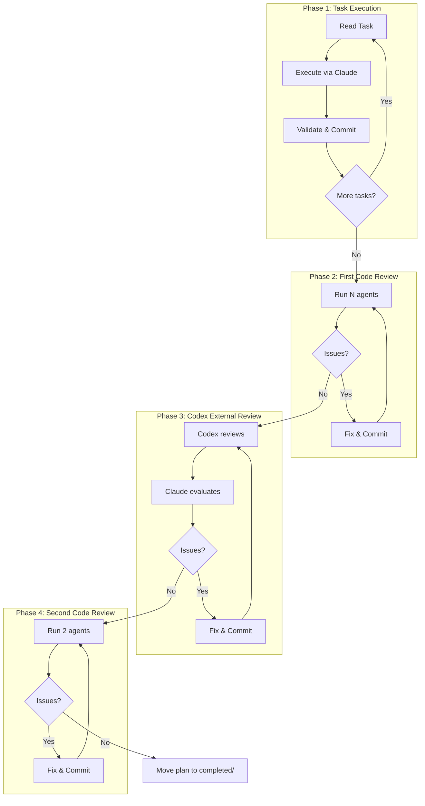

# ralphex [](https://github.com/umputun/ralphex/actions/workflows/ci.yml) [](https://coveralls.io/github/umputun/ralphex?branch=master) [](https://goreportcard.com/report/github.com/umputun/ralphex)

# Autonomous plan execution with Claude Code.

Claude Code is powerful but interactive - it requires you to watch, approve, and guide each step. For complex features spanning multiple tasks, this means hours of babysitting. Worse, as context fills up during long sessions, the model's quality degrades - it starts making mistakes, forgetting earlier decisions, and producing worse code.

ralphex solves both problems. Each task executes in a fresh Claude Code session with minimal context, keeping the model sharp throughout the entire plan. Write a plan with tasks and validation commands, start ralphex, and walk away. Come back to find your feature implemented, reviewed, and committed - or check the progress log to see what it's doing.

## Features

- **Zero setup** - works out of the box with sensible defaults, no configuration required
- **Autonomous task execution** - executes plan tasks one at a time with automatic retry
- **Multi-phase code review** - 5 agents → codex → 2 agents review pipeline
- **Custom review agents** - configurable agents with `{{agent:name}}` template system and user defined prompts
- **Automatic branch creation** - creates git branch from plan filename
- **Plan completion tracking** - moves completed plans to `completed/` folder
- **Automatic commits** - commits after each task and review fix
- **Streaming output** - real-time progress with timestamps and colors
- **Progress logging** - detailed execution logs for debugging
- **Multiple modes** - full execution, review-only, or codex-only

## Quick Start

Make sure ralphex is [installed](#installation) and your project is a git repository. You need a plan file in `docs/plans/`, for example:

```markdown
# Plan: My Feature

## Validation Commands
- `go test ./...`

### Task 1: Implement feature
- [ ] Add the new functionality
- [ ] Add tests
```

Then run:

```bash
ralphex docs/plans/my-feature.md
```

ralphex will create a branch, execute tasks, commit results, run multi-phase reviews, and move the plan to `completed/` when done.

## How It Works

ralphex executes plans in four phases with automated code reviews.

<details>
<summary>Execution Flow Diagram</summary>



</details>

### Phase 1: Task Execution

1. Reads plan file and finds first incomplete task (`### Task N:` with `- [ ]` checkboxes)
2. Sends task to Claude Code for execution
3. Runs validation commands (tests, linters) after each task
4. Marks checkboxes as done `[x]`, commits changes
5. Repeats until all tasks complete or max iterations reached

### Phase 2: First Code Review

Launches 5 review agents **in parallel** via Claude Code Task tool:

| Agent | Purpose |
|-------|---------|
| `quality` | bugs, security issues, race conditions |
| `implementation` | verifies code achieves stated goals |
| `testing` | test coverage and quality |
| `simplification` | detects over-engineering |
| `documentation` | checks if docs need updates |

Claude verifies findings, fixes confirmed issues, and commits.

*These are the default agents. Customize via `~/.config/ralphex/agents/` and `prompts/review_first.txt`.*

### Phase 3: Codex External Review (optional)

1. Runs codex (GPT-5.2) for independent code review
2. Claude evaluates codex findings, fixes valid issues
3. Iterates until codex finds no open issues

### Phase 4: Second Code Review

1. Launches 2 agents (`quality` + `implementation`) for final review
2. Focuses on critical/major issues only
3. Iterates until no issues found
4. Moves plan to `completed/` folder on success

*Second review agents are configurable via `prompts/review_second.txt`.*

## Installation

### From source

```bash
go install github.com/umputun/ralphex/cmd/ralphex@latest
```

### Using Homebrew

```bash
brew install umputun/apps/ralphex
```

### From releases

Download the appropriate binary from [releases](https://github.com/umputun/ralphex/releases).

## Usage

**Note:** ralphex must be run from the repository root directory (where `.git` is located).

```bash
# execute plan with task loop + reviews
ralphex docs/plans/feature.md

# use fzf to select plan
ralphex

# review-only mode (skip task execution)
ralphex --review docs/plans/feature.md

# codex-only mode (skip tasks and first claude review)
ralphex --codex-only

# with custom max iterations
ralphex --max-iterations=100 docs/plans/feature.md
```

### Options

| Flag | Description | Default |
|------|-------------|---------|
| `-m, --max-iterations` | Maximum task iterations | 50 |
| `-r, --review` | Skip task execution, run full review pipeline | false |
| `-c, --codex-only` | Skip tasks and first review, run only codex loop | false |
| `-d, --debug` | Enable debug logging | false |
| `--no-color` | Disable color output | false |

## Plan File Format

Plans are markdown files with task sections. Each task has checkboxes that claude marks complete.

```markdown
# Plan: Add User Authentication

## Overview
Add JWT-based authentication to the API.

## Validation Commands
- `go test ./...`
- `golangci-lint run`

### Task 1: Add auth middleware
- [ ] Create JWT validation middleware
- [ ] Add to router for protected routes
- [ ] Add tests
- [ ] Mark completed

### Task 2: Add login endpoint
- [ ] Create /api/login handler
- [ ] Return JWT on successful auth
- [ ] Add tests
- [ ] Mark completed
```

**Requirements:**
- Task headers must use `### Task N:` or `### Iteration N:` format
- Checkboxes: `- [ ]` (incomplete) or `- [x]` (completed)
- Include `## Validation Commands` section with test/lint commands
- Place plans in `docs/plans/` directory (configurable via `plans_dir`)

## Review Agents

The review pipeline is fully customizable. ralphex ships with sensible defaults that work for any language, but you can modify agents, add new ones, or replace prompts entirely to match your specific workflow.

### Default Agents

These 5 agents cover common review concerns and work well out of the box. Customize or replace them based on your needs:

| Agent | Phase | Purpose |
|-------|-------|---------|
| `quality` | 1st & 2nd | bugs, security issues, race conditions |
| `implementation` | 1st & 2nd | verifies code achieves stated goals |
| `testing` | 1st only | test coverage and quality |
| `simplification` | 1st only | detects over-engineering |
| `documentation` | 1st only | checks if docs need updates |

### Template Syntax

Reference agents in prompt files using `{{agent:name}}` syntax:

```
Launch the following review agents in parallel:
{{agent:quality}}
{{agent:implementation}}
{{agent:testing}}
```

Each `{{agent:name}}` expands to Task tool instructions that tell Claude Code to run that agent.

### Customization

The entire system is designed for customization - both task execution and reviews:

**Agent files** (`~/.config/ralphex/agents/`):
- Edit existing files to modify agent behavior
- Add new `.txt` files to create custom agents
- Delete files and restart to restore defaults
- Reference built-in Claude Code agents (like `qa-expert`, `code-reviewer`) directly

**Prompt files** (`~/.config/ralphex/prompts/`):
- `task.txt` - task execution prompt
- `review_first.txt` - first review prompt (can use custom and built-in Claude agents)
- `codex.txt` - codex review prompt
- `review_second.txt` - second review prompt (can use custom and built-in Claude agents)

**Comment syntax:**
Lines starting with `#` (after optional whitespace) are treated as comments and stripped when loading prompt and agent files. Use comments to document your customizations:

```txt
# security agent - checks for vulnerabilities
# updated: 2024-01-15
check for SQL injection
check for XSS
```

Note: Inline comments are not supported (`text # comment` keeps the entire line).

**Examples:**
- Add a security-focused agent for fintech projects
- Remove `simplification` agent if over-engineering isn't a concern
- Create language-specific agents (Python linting, TypeScript types)
- Modify prompts to change how many agents run per phase

## Requirements

- `claude` - Claude Code CLI
- `fzf` - for plan selection (optional)
- `codex` - for external review (optional)

## Configuration

ralphex uses a configuration directory at `~/.config/ralphex/` with the following structure:

```
~/.config/ralphex/
├── config              # main configuration file (INI format)
├── prompts/            # custom prompt templates
│   ├── task.txt
│   ├── review_first.txt
│   ├── review_second.txt
│   └── codex.txt
└── agents/             # custom review agents (*.txt files)
```

On first run, ralphex creates this directory with default configuration.

### Configuration options

| Option | Description | Default |
|--------|-------------|---------|
| `claude_command` | Claude CLI command | `claude` |
| `claude_args` | Claude CLI arguments | `--dangerously-skip-permissions --output-format stream-json --verbose` |
| `codex_enabled` | Enable codex review phase | `true` |
| `codex_command` | Codex CLI command | `codex` |
| `codex_model` | Codex model ID | `gpt-5.2-codex` |
| `codex_reasoning_effort` | Reasoning effort level | `xhigh` |
| `codex_timeout_ms` | Codex timeout in ms | `3600000` |
| `codex_sandbox` | Sandbox mode | `read-only` |
| `iteration_delay_ms` | Delay between iterations | `2000` |
| `task_retry_count` | Task retry attempts | `1` |
| `plans_dir` | Plans directory | `docs/plans` |
| `color_task` | Task execution phase color (hex) | `#00ff00` |
| `color_review` | Review phase color (hex) | `#00ffff` |
| `color_codex` | Codex review color (hex) | `#ff00ff` |
| `color_claude_eval` | Claude evaluation color (hex) | `#64c8ff` |
| `color_warn` | Warning messages color (hex) | `#ffff00` |
| `color_error` | Error messages color (hex) | `#ff0000` |
| `color_signal` | Completion/failure signals color (hex) | `#ff6464` |
| `color_timestamp` | Timestamp prefix color (hex) | `#8a8a8a` |
| `color_info` | Informational messages color (hex) | `#b4b4b4` |

### Custom prompts

Place custom prompt files in `~/.config/ralphex/prompts/` to override the built-in prompts. Missing files fall back to embedded defaults. See [Review Agents](#review-agents) section for agent customization.

## License

MIT License - see [LICENSE](LICENSE) file.
