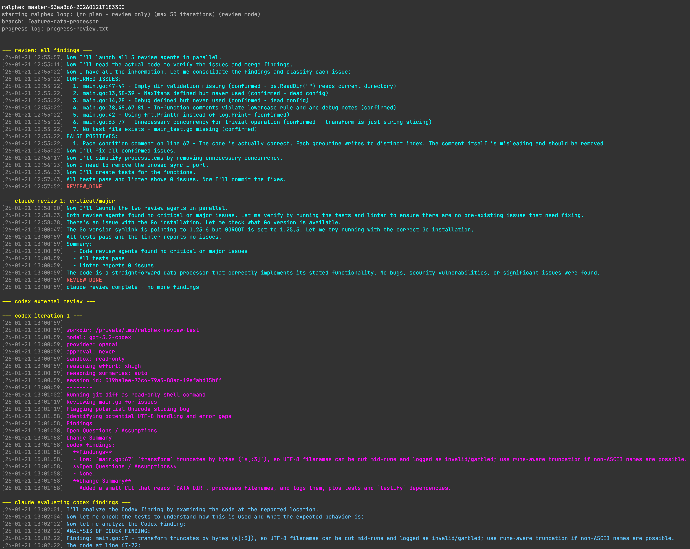

<p align="center">
  
</p>

<p align="center">
  <a href="https://github.com/umputun/ralphex/actions/workflows/ci.yml"></a>
  <a href="https://coveralls.io/github/umputun/ralphex?branch=master"></a>
  <a href="https://goreportcard.com/report/github.com/umputun/ralphex"></a>
</p>

<h2 align="center">Autonomous plan execution with Claude Code</h2>

*ralphex is a standalone CLI tool that runs in your terminal from the root of a git repository. It orchestrates Claude Code to execute implementation plans autonomously - no IDE plugins or cloud services required, just Claude Code and a single binary.*

Claude Code is powerful but interactive - it requires you to watch, approve, and guide each step. For complex features spanning multiple tasks, this means hours of babysitting. Worse, as context fills up during long sessions, the model's quality degrades - it starts making mistakes, forgetting earlier decisions, and producing worse code.

ralphex solves both problems. Each task executes in a fresh Claude Code session with minimal context, keeping the model sharp throughout the entire plan. Write a plan with tasks and validation commands, start ralphex, and walk away. Come back to find your feature implemented, reviewed, and committed - or check the progress log to see what it's doing.

<details markdown>
<summary>Task Execution Screenshot</summary>


</details>

<details markdown>
<summary>Review Mode Screenshot</summary>



</details>

<details markdown>
<summary>Web Dashboard Screenshot</summary>


</details>

## Features

- **Zero setup** - works out of the box with sensible defaults, no configuration required
- **Autonomous task execution** - executes plan tasks one at a time with automatic retry
- **Interactive plan creation** - create plans through dialogue with Claude via `--plan` flag
- **Multi-phase code review** - 5 agents → codex → 2 agents review pipeline
- **Custom review agents** - configurable agents with `{{agent:name}}` template system and user defined prompts
- **Automatic branch creation** - creates git branch from plan filename
- **Plan completion tracking** - moves completed plans to `completed/` folder
- **Automatic commits** - commits after each task and review fix
- **Real-time monitoring** - streaming output with timestamps, colors, and detailed logs
- **Web dashboard** - browser-based real-time view with `--serve` flag
- **Docker support** - run in isolated container for safer autonomous execution
- **Notifications** - optional alerts on completion/failure via Telegram, Email, Slack, Webhook, or custom script
- **Multiple modes** - full execution, tasks-only, review-only, external-only, or plan creation

## Quick Start

Make sure ralphex is [installed](#installation) and your project is a git repository. You need a plan file in `docs/plans/`, for example:

```markdown
# Plan: My Feature

## Validation Commands
- `go test ./...`

### Task 1: Implement feature
- [ ] Add the new functionality
- [ ] Add tests
```

Then run:

```bash
ralphex docs/plans/my-feature.md
```

ralphex will create a branch, execute tasks, commit results, run multi-phase reviews, and move the plan to `completed/` when done.

## How It Works

ralphex executes plans in four phases with automated code reviews.

<details markdown>
<summary>Execution Flow Diagram</summary>


</details>

### Phase 1: Task Execution

1. Reads plan file and finds first incomplete task (`### Task N:` with `- [ ]` checkboxes)
2. Sends task to Claude Code for execution
3. Runs validation commands (tests, linters) after each task
4. Marks checkboxes as done `[x]`, commits changes
5. Repeats until all tasks complete or max iterations reached

### Phase 2: First Code Review

Launches 5 review agents **in parallel** via Claude Code Task tool:

| Agent | Purpose |
|-------|---------|
| `quality` | bugs, security issues, race conditions |
| `implementation` | verifies code achieves stated goals |
| `testing` | test coverage and quality |
| `simplification` | detects over-engineering |
| `documentation` | checks if docs need updates |

Claude verifies findings, fixes confirmed issues, and commits.

*[Default agents](https://github.com/umputun/ralphex/tree/master/pkg/config/defaults/agents) provide common, language-agnostic review steps. They can be customized and tuned for your specific needs, languages, and workflows. See [Customization](#customization) for details.*

### Phase 3: External Review (optional)

1. Runs external review tool (codex by default, or custom script)
2. Claude evaluates findings, fixes valid issues
3. Iterates until no open issues

Supported tools:
- **codex** (default): OpenAI Codex for independent code review
- **custom**: Your own script wrapping any AI (OpenRouter, local LLM, etc.)
- **none**: Skip external review entirely

See [Custom External Review](#custom-external-review) for details on using custom scripts.

### Phase 4: Second Code Review

1. Launches 2 agents (`quality` + `implementation`) for final review
2. Focuses on critical/major issues only
3. Iterates until no issues found
4. Moves plan to `completed/` folder on success

*Second review agents are configurable via `prompts/review_second.txt`.*

### Review-Only Mode

Review-only mode (`--review`) runs the full review pipeline (Phase 2 → Phase 3 → Phase 4) on changes already present on the current branch. This is useful when changes were made outside ralphex — via Claude Code's built-in plan mode, manual edits, other AI agents, or any other workflow.

**Workflow:**

1. Make changes on a feature branch (using any tool or workflow)
2. Commit the changes
3. Run `ralphex --review`

ralphex compares the branch against the default branch (`git diff master...HEAD`), launches multi-agent reviews, and iterates fixes until all agents report clean. No plan file is required — if provided, it gives reviewers additional context about the intended changes.

```bash
# switch to feature branch with existing changes
git checkout feature-auth

# run review pipeline on those changes
ralphex --review

# optionally pass a plan file for context
ralphex --review docs/plans/add-auth.md
```

### Plan Creation

Plans can be created in several ways:
- **[Claude Code](#claude-code-integration-optional)** - use slash commands like `/ralphex-plan` or your own planning workflows
- **Manually** - write markdown files directly in `docs/plans/`
- **`--plan` flag** - integrated option that handles the entire flow
- **Auto-detection** - running `ralphex` without arguments on master/main prompts for plan creation if no plans exist

The `--plan` flag provides a simpler integrated experience:

```bash
ralphex --plan "add health check endpoint"
```

Claude explores your codebase, asks clarifying questions via a terminal picker (fzf or numbered fallback), and generates a complete plan file in `docs/plans/`.

**Example session:**
```
$ ralphex --plan "add caching for API responses"
[10:30:05] analyzing codebase structure...
[10:30:12] found existing store layer in pkg/store/

QUESTION: Which cache backend?
  > Redis
    In-memory
    File-based
    Other (type your own answer)

[10:30:45] ANSWER: Redis
[10:31:00] continuing plan creation...
[10:32:05] plan written to docs/plans/add-api-caching.md

Continue with plan implementation?
  > Yes, execute plan
    No, exit
```

After plan creation, you can choose to continue with immediate execution or exit to run ralphex later. Progress is logged to `.ralphex/progress/progress-plan-<name>.txt`.

## Installation

### From source

```bash
go install github.com/umputun/ralphex/cmd/ralphex@latest
```

### Using Homebrew

```bash
brew install umputun/apps/ralphex
```

### From releases

Download the appropriate binary from [releases](https://github.com/umputun/ralphex/releases).

### Using Docker

Download the wrapper script and install to PATH:

```bash
curl -sL https://raw.githubusercontent.com/umputun/ralphex/master/scripts/ralphex-dk.sh -o /usr/local/bin/ralphex
chmod +x /usr/local/bin/ralphex
```

The script defaults to the Go image (`ralphex-go`). For other languages, build a custom image from the base with your toolchain installed (see [Available images](#available-images) for examples), then point the wrapper at it:
```bash
export RALPHEX_IMAGE=my-ralphex
```

Then use `ralphex` as usual - it runs in a container with Claude Code and Codex pre-installed. The script shows which image it's using at startup.

**Why use Docker?** ralphex runs Claude Code with `--dangerously-skip-permissions`, giving it full access to execute commands and modify files. Running in a container provides isolation - Claude can only access the mounted project directory, not your entire system. This makes autonomous execution significantly safer.

<details markdown>
<summary>Isolation details</summary>

**Container CAN access (read-write):**
- Project directory mounted at `/workspace` - full access to create, modify, delete files
- Git operations within the project (branch, commit, etc.)

**Container CAN access (read-only):**
- `~/.claude/` - credentials and settings (copied at startup, not modified)
- `~/.codex/` - codex credentials if present
- `~/.config/ralphex/` - user-level ralphex configuration
- `~/.gitconfig` - git identity for commits
- `.ralphex/` - project-level configuration if present

**Container CANNOT access:**
- Host filesystem outside mounted directories
- Other projects or repositories
- SSH keys, AWS credentials, or other secrets in `~/.ssh`, `~/.aws`, etc.
- System files, binaries, or configurations
- Other running processes or containers

**Network:** Full network access (required for Claude API calls)

**Privileges:** Runs as non-root user with no elevated capabilities

</details>

**Volume mounts:**
- **Read-only**: `~/.claude` and `~/.codex` mounted to `/mnt/`, copied at startup to preserve isolation
- **Read-write**: project directory (`/workspace`) - where ralphex creates branches, edits code, and commits

**Requirements:**
- Python 3.9+ (for the wrapper script)
- Docker installed and running
- Claude Code credentials in `~/.claude/` (or in `$CLAUDE_CONFIG_DIR` when set)
- Codex credentials in `~/.codex/` (optional, for codex review phase)
- Git config in `~/.gitconfig` (for commits)

**Environment variables:**
- `RALPHEX_IMAGE` - Docker image to use (default: `ghcr.io/umputun/ralphex-go:latest`)
- `RALPHEX_PORT` - Port for web dashboard when using `--serve` (default: `8080`)
- `RALPHEX_CONFIG_DIR` - Custom config directory (default: `~/.config/ralphex`). Overrides global config location for prompts, agents, and settings
- `CLAUDE_CONFIG_DIR` - Claude config directory (default: `~/.claude`). Use for alternate Claude installations (e.g., `~/.claude2`). Works both with Docker wrapper (volume mounts and keychain derivation) and non-Docker usage (passed through to Claude Code directly). Keychain service name is derived automatically from the path.

**Updating:**
```bash
ralphex --update         # pull latest docker image
ralphex --update-script  # update the wrapper script itself
```

<details markdown>
<summary>Available images</summary>

Two images are published:

| Image | Description |
|-------|-------------|
| `ghcr.io/umputun/ralphex:latest` | Base image with Claude Code, Codex, and core tools |
| `ghcr.io/umputun/ralphex-go:latest` | Go development (extends base with Go toolchain) |

**Base image includes:**

| Tool | Version | Purpose |
|------|---------|---------|
| Claude Code | latest | AI coding assistant |
| Codex | latest | External code review |
| Node.js/npm | 24.x | Required for Claude Code |
| Python/pip | 3.x | Scripts and automation |
| git | 2.x | Version control |
| make | 4.x | Build automation |
| gcc, musl-dev | - | C compiler for native extensions |
| bash | 5.x | Shell |
| fzf | - | Fuzzy finder for plan selection |
| ripgrep | - | Fast search (used by Claude Code) |

**Go image adds:**

| Tool | Version | Purpose |
|------|---------|---------|
| Go | 1.26.0 | Go compiler and runtime |
| golangci-lint | latest | Go linter |
| moq | latest | Mock generator |
| goimports | latest | Import formatter |

**For Go projects**, use the `-go` image:
```bash
RALPHEX_IMAGE=ghcr.io/umputun/ralphex-go:latest ralphex docs/plans/feature.md
```

**For other languages**, create a custom image by extending the base with your language toolchain. The Go image (`Dockerfile-go`) shows the pattern:

```dockerfile
FROM ghcr.io/umputun/ralphex:latest

# install go from official distribution
ARG GO_VERSION=1.26.0
RUN ARCH=$(uname -m | sed 's/x86_64/amd64/;s/aarch64/arm64/') && \
    wget -qO- "https://go.dev/dl/go${GO_VERSION}.linux-${ARCH}.tar.gz" | tar -xz -C /usr/local

ENV GOROOT=/usr/local/go
ENV GOPATH=/home/app/go
ENV PATH="${PATH}:${GOROOT}/bin:${GOPATH}/bin"

# install go tools
RUN wget -qO- https://raw.githubusercontent.com/golangci/golangci-lint/HEAD/install.sh | sh -s -- -b /usr/local/bin && \
    GOBIN=/usr/local/bin go install github.com/matryer/moq@latest && \
    GOBIN=/usr/local/bin go install golang.org/x/tools/cmd/goimports@latest
```

Same approach for Rust, Java, or any other language:
```dockerfile
FROM ghcr.io/umputun/ralphex:latest

# rust
RUN apk add --no-cache rust cargo
ENV CARGO_HOME=/home/app/.cargo PATH="${PATH}:${CARGO_HOME}/bin"

# java
RUN apk add --no-cache openjdk21-jdk
ENV JAVA_HOME=/usr/lib/jvm/java-21-openjdk PATH="${PATH}:${JAVA_HOME}/bin"
```

Build and use:
```bash
docker build -t my-ralphex -f Dockerfile.python .
RALPHEX_IMAGE=my-ralphex ralphex docs/plans/feature.md
```

</details>

Example with custom port:
```bash
RALPHEX_PORT=3000 ralphex --serve --port 3000 docs/plans/feature.md
```

## Usage

**Note:** ralphex must be run from the repository root directory (where `.git` is located).

```bash
# execute plan with task loop + reviews
ralphex docs/plans/feature.md

# select plan with fzf, or create one interactively if none exist
ralphex

# review-only mode (skip task execution)
ralphex --review docs/plans/feature.md

# external-only mode (skip tasks and first review, run only external review loop)
ralphex --external-only

# tasks-only mode (run only task phase, skip all reviews)
ralphex --tasks-only docs/plans/feature.md

# interactive plan creation
ralphex --plan "add user authentication"

# with custom max iterations
ralphex --max-iterations=100 docs/plans/feature.md

# with web dashboard
ralphex --serve docs/plans/feature.md

# web dashboard on custom port
ralphex --serve --port 3000 docs/plans/feature.md
```

### Options

| Flag | Description | Default |
|------|-------------|---------|
| `-m, --max-iterations` | Maximum task iterations | 50 |
| `-r, --review` | Skip task execution, run full review pipeline | false |
| `-e, --external-only` | Skip tasks and first review, run only external review loop | false |
| `-c, --codex-only` | Alias for `--external-only` (deprecated) | false |
| `-t, --tasks-only` | Run only task phase, skip all reviews | false |
| `--plan` | Create plan interactively (provide description) | - |
| `-s, --serve` | Start web dashboard for real-time streaming | false |
| `-p, --port` | Web dashboard port (used with `--serve`) | 8080 |
| `-w, --watch` | Directories to watch for progress files (repeatable) | - |
| `-d, --debug` | Enable debug logging | false |
| `--no-color` | Disable color output | false |
| `--reset` | Interactively reset global config to embedded defaults | - |
| `--dump-defaults` | Extract raw embedded defaults to specified directory | - |
| `--config-dir` | Custom config directory (env: `RALPHEX_CONFIG_DIR`) | `~/.config/ralphex` |

## Plan File Format

Plans are markdown files with task sections. Each task has checkboxes that claude marks complete.

```markdown
# Plan: Add User Authentication

## Overview
Add JWT-based authentication to the API.

## Validation Commands
- `go test ./...`
- `golangci-lint run`

### Task 1: Add auth middleware
- [ ] Create JWT validation middleware
- [ ] Add to router for protected routes
- [ ] Add tests
- [ ] Mark completed

### Task 2: Add login endpoint
- [ ] Create /api/login handler
- [ ] Return JWT on successful auth
- [ ] Add tests
- [ ] Mark completed
```

**Requirements:**
- Task headers must use `### Task N:` or `### Iteration N:` format
- Checkboxes: `- [ ]` (incomplete) or `- [x]` (completed)
- Include `## Validation Commands` section with test/lint commands
- Place plans in `docs/plans/` directory (configurable via `plans_dir`)

## Review Agents

The review pipeline is fully customizable. ralphex ships with sensible defaults that work for any language, but you can modify agents, add new ones, or replace prompts entirely to match your specific workflow.

### Default Agents

These 5 agents cover common review concerns and work well out of the box. Customize or replace them based on your needs:

| Agent | Phase | Purpose |
|-------|-------|---------|
| `quality` | 1st & 2nd | bugs, security issues, race conditions |
| `implementation` | 1st & 2nd | verifies code achieves stated goals |
| `testing` | 1st only | test coverage and quality |
| `simplification` | 1st only | detects over-engineering |
| `documentation` | 1st only | checks if docs need updates |

### Agent Options (Frontmatter)

Agent files support optional YAML frontmatter for per-agent configuration:

```txt
---
model: haiku
agent: code-reviewer
---
Review the code for quality issues...
```

| Option | Values | Description |
|--------|--------|-------------|
| `model` | `haiku`, `sonnet`, `opus` | Claude model for this agent |
| `agent` | any string | Claude Code Task tool subagent type |

Both options are optional. Without frontmatter, agents use default model and `general-purpose` subagent type. Full model IDs (e.g. `claude-sonnet-4-5-20250929`) are normalized to short keywords (`sonnet`) since Claude Code only accepts `haiku`, `sonnet`, `opus`. Invalid model values are dropped with a warning.

### Template Syntax

Custom prompt files support variable expansion. All variables use the `{{VARIABLE}}` syntax.

**Available variables:**

| Variable | Description | Example value |
|----------|-------------|---------------|
| `{{PLAN_FILE}}` | Path to the plan file being executed | `docs/plans/feature.md` |
| `{{PROGRESS_FILE}}` | Path to the progress log file | `.ralphex/progress/progress-feature.txt` |
| `{{GOAL}}` | Human-readable goal description | `implementation of plan at docs/plans/feature.md` |
| `{{DEFAULT_BRANCH}}` | Default branch name (detected from repo) | `main`, `master`, `origin/main` |
| `{{agent:name}}` | Expands to Task tool instructions for the named agent | (see below) |

**Agent references:**

Reference agents in prompt files using `{{agent:name}}` syntax:

```
Launch the following review agents in parallel:
{{agent:quality}}
{{agent:implementation}}
{{agent:testing}}
```

Each `{{agent:name}}` expands to Task tool instructions that tell Claude Code to run that agent. Variables inside agent content are also expanded, so agents can use `{{DEFAULT_BRANCH}}` or other variables.

### Customization

The entire system is designed for customization - both task execution and reviews:

**Agent files** (`~/.config/ralphex/agents/`):
- Edit existing files to modify agent behavior
- Add new `.txt` files to create custom agents
- Run `ralphex --reset` to interactively restore defaults, or delete all files manually
- Run `ralphex --dump-defaults <dir>` to extract raw defaults for comparison
- Use the `/ralphex-update` Claude Code skill to smart-merge updated defaults into customized files
- Alternatively, reference agents already installed in your Claude Code directly in prompt files (see example below)

**Prompt files** (`~/.config/ralphex/prompts/`):
- `task.txt` - task execution prompt
- `review_first.txt` - comprehensive review (default: 5 language-agnostic agents - quality, implementation, testing, simplification, documentation; customizable)
- `codex.txt` - codex review prompt
- `review_second.txt` - final review, critical/major issues only (default: 2 agents - quality, implementation; customizable)
- `finalize.txt` - optional finalize step prompt (disabled by default)

**Comment lines and markdown headers:**
A leading block of 2+ contiguous comment lines (starting with `#`) at the top of a file is treated as a meta-comment and stripped when loading. A single `# Title` at the top is preserved (treated as a markdown header). Comment lines appearing later in the file body are always preserved:

```txt
# This single title line is preserved as a markdown header
check for SQL injection
# this mid-body comment is also preserved
check for XSS
```

Files containing *only* comment lines (every line starts with `#`) are treated as unmodified templates and fall back to embedded defaults. This is how commented-out default files work — once you add any non-comment content, the file is used as-is.

Note: Inline comments are not supported (`text # comment` keeps the entire line).

**Examples:**
- Add a security-focused agent for fintech projects
- Remove `simplification` agent if over-engineering isn't a concern
- Create language-specific agents (Python linting, TypeScript types)
- Modify prompts to change how many agents run per phase

**Using Claude Code agents directly:**

Instead of creating agent files, you can reference agents installed in your Claude Code directly in prompt files:

```txt
# in review_first.txt - just list agent names with their prompts
Agents to launch:
1. qa-expert - "Review for bugs and security issues"
2. go-test-expert - "Review test coverage and quality"
3. go-smells-expert - "Review for code smells"
```

## Requirements

- `claude` - Claude Code CLI
- `fzf` - for plan selection (optional)
- `codex` - for external review (optional)

## Configuration

ralphex uses a configuration directory at `~/.config/ralphex/` (override with `--config-dir` or `RALPHEX_CONFIG_DIR`) with the following structure:

```
~/.config/ralphex/
├── config              # main configuration file (INI format)
├── prompts/            # custom prompt templates
│   ├── task.txt
│   ├── review_first.txt
│   ├── review_second.txt
│   └── codex.txt
└── agents/             # custom review agents (*.txt files)
```

On first run, ralphex creates this directory with default configuration.

**Commented templates:**
- Config files are installed with all content commented out (`# ` prefix)
- Uncomment only the settings you want to customize
- Files that remain all-commented receive automatic updates with new defaults
- Once you uncomment any setting, the file is preserved and won't be overwritten

### Local Project Config

Projects can override global settings with a `.ralphex/` directory in the project root:

```
project/
├── .ralphex/           # optional, project-local config
│   ├── config          # overrides specific settings
│   ├── prompts/        # custom prompts for this project
│   └── agents/         # custom agents for this project
```

**Priority:** CLI flags > local `.ralphex/` > global `~/.config/ralphex/` > embedded defaults

Use `--config-dir` or `RALPHEX_CONFIG_DIR` to override the global config location. This is useful for maintaining separate agent/prompt sets for different workflows.

**Merge behavior:**
- **Config file**: per-field override (local values override global, missing fields fall back)
- **Prompts**: per-file fallback (local → global → embedded for each prompt file)
- **Agents**: replace entirely (if local `agents/` has `.txt` files, use ONLY local agents)

### Configuration options

| Option | Description | Default |
|--------|-------------|---------|
| `claude_command` | Claude CLI command | `claude` |
| `claude_args` | Claude CLI arguments | `--dangerously-skip-permissions --output-format stream-json --verbose` |
| `codex_enabled` | Enable codex review phase | `true` |
| `codex_command` | Codex CLI command | `codex` |
| `codex_model` | Codex model ID | `gpt-5.3-codex` |
| `codex_reasoning_effort` | Reasoning effort level | `xhigh` |
| `codex_timeout_ms` | Codex timeout in ms | `3600000` |
| `codex_sandbox` | Sandbox mode | `read-only` |
| `external_review_tool` | External review tool (`codex`, `custom`, `none`) | `codex` |
| `custom_review_script` | Path to custom review script (when `external_review_tool = custom`) | - |
| `iteration_delay_ms` | Delay between iterations | `2000` |
| `task_retry_count` | Task retry attempts | `1` |
| `finalize_enabled` | Enable finalize step after reviews | `false` |
| `plans_dir` | Plans directory | `docs/plans` |
| `color_task` | Task execution phase color (hex) | `#00ff00` |
| `color_review` | Review phase color (hex) | `#00ffff` |
| `color_codex` | Codex review color (hex) | `#ff00ff` |
| `color_claude_eval` | Claude evaluation color (hex) | `#64c8ff` |
| `color_warn` | Warning messages color (hex) | `#ffff00` |
| `color_error` | Error messages color (hex) | `#ff0000` |
| `color_signal` | Completion/failure signals color (hex) | `#ff6464` |
| `color_timestamp` | Timestamp prefix color (hex) | `#8a8a8a` |
| `color_info` | Informational messages color (hex) | `#b4b4b4` |
| `claude_error_patterns` | Patterns to detect in claude output (comma-separated) | `You've hit your limit` |
| `codex_error_patterns` | Patterns to detect in codex output (comma-separated) | `Rate limit,quota exceeded` |

Colors use 24-bit RGB (true color), supported natively by all modern terminals (iTerm2, Kitty, Terminal.app, Windows Terminal, GNOME Terminal, Alacritty, Zed, VS Code, etc). Older terminals will degrade gracefully. Use `--no-color` to disable colors entirely.

Error patterns use case-insensitive substring matching. When a pattern is detected in claude or codex output, ralphex exits gracefully with an informative message suggesting how to check usage/status. Multiple patterns are separated by commas, with whitespace trimmed from each pattern.

### Custom prompts

Place custom prompt files in `~/.config/ralphex/prompts/` to override the built-in prompts. Missing files fall back to embedded defaults. See [Review Agents](#review-agents) section for agent customization.

### Custom External Review

Use your own AI tool for external code review instead of codex. This allows integration with OpenRouter, local LLMs, or any custom pipeline.

**Configuration:**

```ini
# in ~/.config/ralphex/config
external_review_tool = custom
custom_review_script = ~/.config/ralphex/scripts/my-review.sh
```

**Script interface:**

Your script receives a single argument: path to a prompt file containing review instructions. The script outputs findings to stdout - ralphex passes them to Claude for evaluation and fixing.

```bash
#!/bin/bash
# example: ~/.config/ralphex/scripts/my-review.sh
prompt_file="$1"

# read the prompt (contains diff instructions, goal, review focus)
prompt=$(cat "$prompt_file")

# call your AI tool (OpenRouter, local LLM, etc.)
# example with curl to OpenRouter:
curl -s https://openrouter.ai/api/v1/chat/completions \
  -H "Authorization: Bearer $OPENROUTER_API_KEY" \
  -H "Content-Type: application/json" \
  -d "{
    \"model\": \"anthropic/claude-3.5-sonnet\",
    \"messages\": [{\"role\": \"user\", \"content\": $(echo "$prompt" | jq -Rs .)}]
  }" | jq -r '.choices[0].message.content'
```

**Expected output format:**

- Write findings to stdout as a structured list
- Use format: `file:line - description of issue`
- Output `NO ISSUES FOUND` when there are no problems

**Iteration behavior:**

The prompt's `{{DIFF_INSTRUCTION}}` variable adapts per iteration:
- **First iteration**: `git diff main...HEAD` (all changes in feature branch)
- **Subsequent iterations**: `git diff` (only uncommitted changes from previous fixes)

This lets the review tool focus on remaining issues after fixes.

### Notifications

ralphex can send notifications when execution completes or fails. Notifications are optional, disabled by default, and best-effort - failures are logged but never affect the exit code.

```ini
# in ~/.config/ralphex/config or .ralphex/config
notify_channels = telegram, webhook
notify_telegram_token = 123456:ABC-DEF
notify_telegram_chat = -1001234567890
notify_webhook_urls = https://hooks.example.com/notify
```

Supported channels: `telegram`, `email`, `slack`, `webhook`, `custom` (script). Misconfigured channels are detected at startup.

See [docs/notifications.md](docs/notifications.md) for setup guides, message format examples, and custom script integration.

**Prompt customization:**

Customize `~/.config/ralphex/prompts/custom_review.txt` to modify the prompt sent to your script. Available variables:
- `{{DIFF_INSTRUCTION}}` - git diff command appropriate for current iteration
- `{{GOAL}}` - human-readable description of what's being implemented
- `{{PLAN_FILE}}` - path to the plan file
- `{{DEFAULT_BRANCH}}` - detected default branch (main, master, etc.)

Customize `~/.config/ralphex/prompts/custom_eval.txt` to modify how Claude evaluates your tool's output.

**Docker considerations:**

When running ralphex in Docker, your script must be accessible inside the container:
- Mount your scripts directory: `-v ~/.config/ralphex/scripts:/home/app/.config/ralphex/scripts:ro`
- Ensure script dependencies are available (curl, jq, etc. are included in base image)
- Environment variables (API keys) must be passed to container: `-e OPENROUTER_API_KEY`

<details markdown>
<summary><b>FAQ</b></summary>

**I installed ralphex, what do I do next?**

Create a plan file in `docs/plans/` (see [Quick Start](#quick-start) for format), then run `ralphex docs/plans/your-plan.md`. ralphex will create a branch, execute tasks, and run reviews automatically.

**Why are there two review phases?**

First review is comprehensive (5 agents by default), second is a final check focusing on critical/major issues only (2 agents). See [How It Works](#how-it-works).

**How do I use my own Claude Code agents?**

Reference them directly in prompt files by name, e.g., `qa-expert - "Review for bugs"`. See [Customization](#customization).

**What if codex isn't installed?**

Codex is optional. If not installed, the codex review phase is skipped automatically.

**Can I run just reviews without task execution?**

Yes, use `--review` flag to run the full review pipeline (Phase 2 → Phase 3 → Phase 4) on changes already on the current branch. This works for changes made by any tool — Claude Code's built-in mode, manual edits, other agents, etc. Switch to the feature branch, commit your changes, and run `ralphex --review`. See [Review-Only Mode](#review-only-mode) for details.

**Can I run ralphex in a non-git directory?**

No. Git is required for branch management, automatic commits, and diff-based code reviews.

**What if my repository has no commits?**

ralphex prompts to create an initial commit when the repository is empty. This is required because ralphex needs branches for feature isolation. Answer "y" to let ralphex stage all files and create an initial commit, or create one manually first with `git add . && git commit -m "initial commit"`.

**Should I run ralphex on master or a feature branch?**

For full mode, start on master - ralphex creates a branch automatically from the plan filename. For `--review` mode, switch to your feature branch first - reviews compare against master using `git diff master...HEAD`.

**How do I restore default agents after customizing?**

Run `ralphex --reset` to interactively reset global config. Select which components to reset (config, prompts, agents). Alternatively, delete all `.txt` files from `~/.config/ralphex/agents/` manually. To smart-merge updated defaults into customized files (preserving your changes), use the `/ralphex-update` Claude Code skill or `ralphex --dump-defaults <dir>` to extract defaults for manual comparison.

**How does local .ralphex/ config interact with global config?**

Priority: CLI flags > local `.ralphex/config` > global `~/.config/ralphex/config` > embedded defaults. Each local setting overrides the corresponding global one—no need to duplicate the entire file. For agents: if local `agents/` has any `.txt` files, it replaces global agents entirely.

**What happens to uncommitted changes if ralphex fails?**

Ralphex commits after each completed task. If execution fails, completed tasks are already committed to the feature branch. Uncommitted changes from the failed task remain in the working directory for manual inspection.

**What if ralphex is interrupted mid-execution?**

Completed tasks are already committed to the feature branch. To resume, re-run `ralphex docs/plans/<plan>.md`. Ralphex detects completed tasks via `[x]` checkboxes in the plan and continues from the first incomplete task. For review sessions, simply restart. Reviews re-run from iteration 1, but fixes from previous iterations remain in the codebase.

**Can I adjust the plan or change direction while ralphex is running?**

Yes, two approaches depending on the situation:

1. **Edit CLAUDE.md** — for behavioral changes (coding style, libraries, constraints). Each task runs in a fresh Claude Code session that reads CLAUDE.md at startup, so changes take effect on the next task or iteration automatically. No need to stop ralphex.

2. **Stop, edit plan, re-run** — for structural changes (reorder tasks, add/remove tasks, change requirements). Press Ctrl+C to stop, edit the plan file (uncheck `[x]` → `[ ]` to redo tasks, add new tasks, modify descriptions), then re-run `ralphex docs/plans/<plan>.md`. Ralphex picks up from the first incomplete task and adapts to the updated plan.

**What's the difference between progress file and plan file?**

Progress file (`.ralphex/progress/progress-*.txt`) is a real-time execution log—tail it to monitor. Plan file tracks task state (`[ ]` vs `[x]`). To resume, re-run ralphex on the plan file; it finds incomplete tasks automatically.

**Do I need to commit changes before running ralphex?**

It depends. If the plan file is the only uncommitted change, ralphex auto-commits it after creating the feature branch and continues execution. If other files have uncommitted changes, ralphex shows a helpful error with options: stash temporarily (`git stash`), commit first (`git commit -am "wip"`), or use review-only mode (`ralphex --review`).

**What's the difference between agents/ and prompts/?**

Agents define *what* to check (review instructions). Prompts define *how* the workflow runs (execution steps, signal handling).

**Can I use Cursor CLI instead of Claude Code?**

Yes. [Cursor CLI](https://cursor.com/cli) is community-tested as a drop-in alternative. Configure in `~/.config/ralphex/config`:

```ini
claude_command = agent
claude_args = --force --output-format stream-json
```

Key differences: `agent` command (not `claude`), `--force` flag (not `--dangerously-skip-permissions`). Stream format and signals are compatible. *Note: this is community-tested, not officially supported. Compatibility depends on Cursor maintaining Claude Code compatibility.*

**How do I use multiple Claude accounts?**

Set the `CLAUDE_CONFIG_DIR` environment variable to point to the alternate Claude config directory:

```bash
CLAUDE_CONFIG_DIR=~/.claude2 ralphex docs/plans/feature.md
```

This is the same env var Claude Code itself uses. With Docker, the wrapper script mounts the specified directory and derives the correct macOS Keychain service name from the path. Without Docker, the env var passes through to the child Claude Code process directly. Each Claude installation stores credentials under a unique Keychain entry based on its config directory. No additional configuration is needed — just point `CLAUDE_CONFIG_DIR` to the right directory.

**Can I run something after all phases complete (notifications, rebase commits, etc.)?**

Yes. Enable the finalize step with `finalize_enabled = true` in config. It runs once after successful review phases (best-effort—failures are logged but don't block success). The default `finalize.txt` prompt rebases onto the default branch and optionally squashes commits into logical groups. Customize `~/.config/ralphex/prompts/finalize.txt` for other actions like sending notifications, pushing to remote, or running custom scripts.

</details>

## Web Dashboard

The `--serve` flag starts a browser-based dashboard for real-time monitoring of plan execution.

```bash
ralphex --serve docs/plans/feature.md
# web dashboard: http://localhost:8080
```

### Features

- **Real-time streaming** - SSE connection for live output updates
- **Phase navigation** - filter by All/Task/Review/Codex phases
- **Collapsible sections** - organized output with expand/collapse
- **Text search** - find text with highlighting (keyboard: `/` to focus, `Escape` to clear)
- **Auto-scroll** - follows output, click to disable
- **Late-join support** - new clients receive full history

The dashboard uses a dark theme with phase-specific colors matching terminal output. All file and stdout logging continues unchanged when using `--serve`.

### Multi-Session Mode

The `--watch` flag enables monitoring multiple ralphex sessions simultaneously:

```bash
# watch specific directories for progress files
ralphex --serve --watch ~/projects/frontend --watch ~/projects/backend

# configure watch directories in config file
# watch_dirs = /home/user/projects, /var/log/ralphex
```

Multi-session features:
- **Session sidebar** - lists all discovered sessions, click to switch (keyboard: `S` to toggle)
- **Active detection** - pulsing indicator for running sessions via file locking
- **Auto-discovery** - new sessions appear automatically as they start

## Claude Code Integration (Optional)

ralphex works standalone from the terminal. Optionally, you can add slash commands to Claude Code for a more integrated experience.

### Available Commands

| Command | Description |
|---------|-------------|
| `/ralphex` | Launch and monitor ralphex execution with interactive mode/plan selection |
| `/ralphex-plan` | Create structured implementation plans with guided context gathering |
| `/ralphex-update` | Smart-merge updated embedded defaults into customized prompts/agents |

### Installation

The ralphex CLI is the primary interface. Claude Code skills (`/ralphex`, `/ralphex-plan`, and `/ralphex-update`) are optional convenience commands.

**Via Plugin Marketplace (Recommended)**

```bash
# Add ralphex marketplace
/plugin marketplace add umputun/ralphex

# Install the plugin
/plugin install ralphex@umputun-ralphex
```

Benefits: Auto-updates when marketplace refreshes (at Claude Code startup).

**Manual Installation (Alternative)**

The slash command definitions are hosted at:
- [`/ralphex`](https://ralphex.com/assets/claude/ralphex.md)
- [`/ralphex-plan`](https://ralphex.com/assets/claude/ralphex-plan.md)
- [`/ralphex-update`](https://ralphex.com/assets/claude/ralphex-update.md)

To install, ask Claude Code to "install ralphex slash commands" or manually copy the files to `~/.claude/commands/`.

### Usage

Once installed:

```
# in Claude Code conversation
/ralphex-plan add user authentication    # creates plan interactively
/ralphex docs/plans/auth.md              # launches execution
"check ralphex"                          # gets status update
```

The `/ralphex` command runs ralphex in the background and provides status updates on request. The `/ralphex-plan` command guides you through creating well-structured plans with context discovery and approach selection.

## For LLMs

See [llms.txt](llms.txt) for LLM-optimized documentation.

## License

MIT License - see [LICENSE](LICENSE) file.
